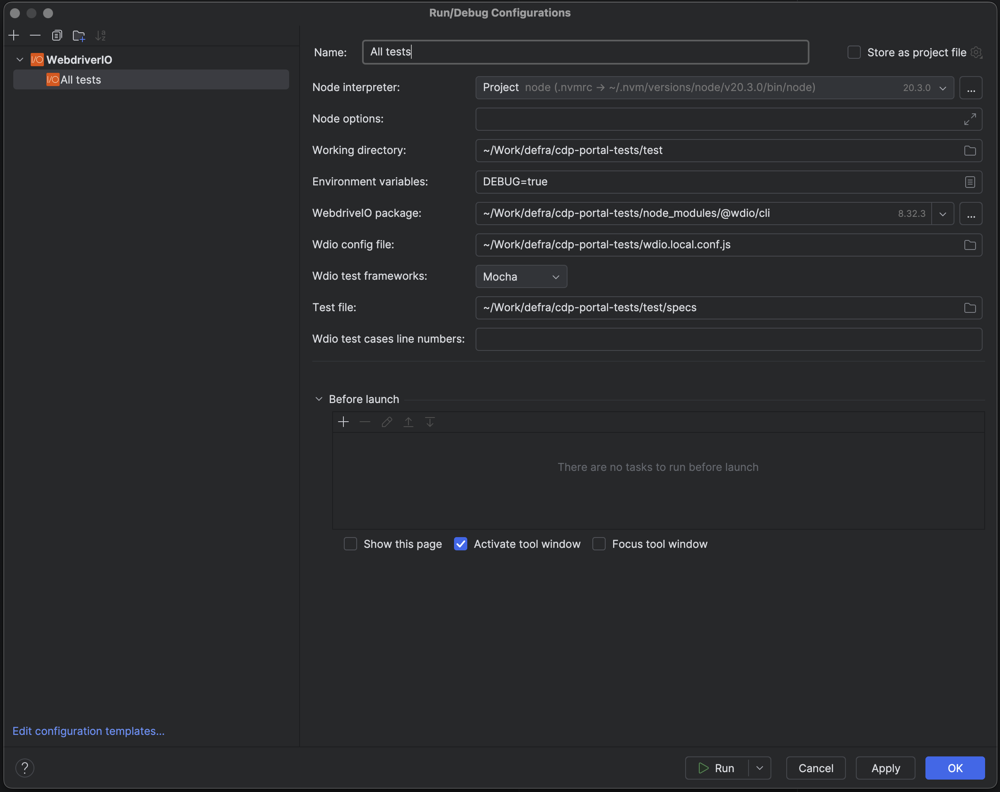
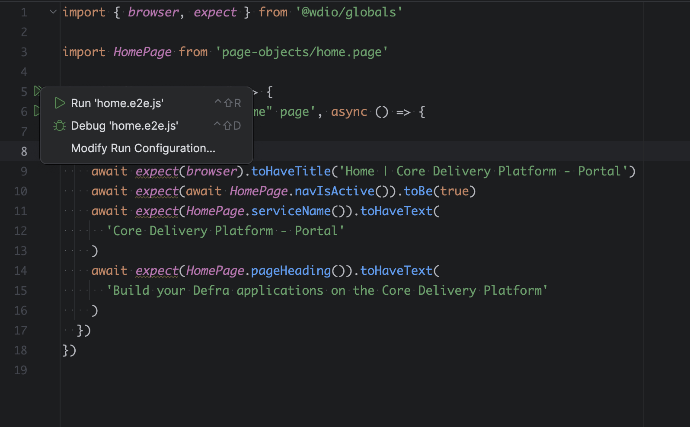

# cdp-portal-journey-tests

Testing CDP Portal.

WDIO tests against an environment, github workflow or locally.

> [!WARNING]
> DO NOT DEPLOY THESE TESTS TO AN CDP ENVIRONMENT AT THE MOMENT!
> Contains non-ephemeral flows.

- [Requirements](#requirements)
  - [Node.js](#nodejs)
  - [Setup](#setup)
- [Local Development](#local-development)
- [Running](#running)
  - [Test](#test)
  - [GitHub](#github)
  - [Local](#local)
  - [Local with debug](#local-with-debug)
  - [Docker and Docker Local](#docker-and-docker-local)
  - [Running individual tests](#running-individual-tests)
- [Running against local service running via npm](#running-against-local-service-running-via-npm)
  - [Stop the compose service](#stop-the-compose-service)
  - [Launch the local service from terminal or IDE](#launch-the-local-service-from-terminal-or-ide)
  - [Custom URL](#custom-url)
  - [Running a local version of the frontend](#running-a-local-version-of-the-frontend)
  - [Running a local version of self-service-ops](#running-a-local-version-of-self-service-ops)
  - [Running a local version of user-service-backend](#running-a-local-version-of-user-service-backend)
  - [Running a local version of the stubs](#running-a-local-version-of-the-stubs)
- [Diagnosing issues](#diagnosing-issues)
  - [Docker container logs](#docker-container-logs)
  - [Docker container information](#docker-container-information)
  - [Connect to Redis container](#connect-to-redis-container)
  - [Connect to Mongo Docker](#connect-to-mongo-docker)
- [Debugging](#debugging)
  - [WebdriverIO Plugin](#webdriverio-plugin)
  - [Setup in IntelliJ/Webstorm](#setup-in-intellijwebstorm)
  - [Debug environment variable](#debug-environment-variable)
  - [WebdriverIO debug command](#webdriverio-debug-command)
- [Production](#production)
  - [Running the tests](#running-the-tests)
- [Requirements of CDP Environment Tests](#requirements-of-cdp-environment-tests)
- [Running on GitHub](#running-on-github)
- [Licence](#licence)
  - [About the licence](#about-the-licence)

## Requirements

### Node.js

Please install [Node.js](http://nodejs.org/) `>= v22` and [npm](https://nodejs.org/) `>= v9`.

> [!TIP]
> To install Node.js and npm Use Node Version Manager [nvm](https://github.com/creationix/nvm)

To use the correct version of Node.js for this application, via nvm:

```bash
cd cdp-portal-journey-tests
nvm use
```

### Setup

Install application dependencies:

```bash
npm install
```

## Local Development

To run locally, use the compose.local.yml file in this repository to run the tests against a local instance of the CDP
Portal.

1. `docker compose --profile portal -f compose.common.yml -f compose.local.yml pull`
1. `docker compose --profile portal -f compose.common.yml -f compose.local.yml up --force-recreate`

## Running

There are various ways to run these tests via `npm scripts`. Easiest way to work out what they do is to look at the urls
used in the below table. Under the table there are more details on when to use the specific `npm scripts`.

| Command                     | Description                                                                                                                                                      | Use                                                                                  |
| --------------------------- | ---------------------------------------------------------------------------------------------------------------------------------------------------------------- | ------------------------------------------------------------------------------------ |
| `npm test`                  | Run in portal against `https://cdp-portal-journey-tests.${process.env.ENVIRONMENT}.cdp-int.defra.cloud`                                                          | In the Portal UI against specified environment                                       |
| `npm test:github`           | Run in CI against `http://cdp-portal-frontend:3000` and the cdp-portal-journey-tests docker compose                                                              | In GitHub CI against cdp-portal-journey-tests docker compose                         |
| `npm run test:local`        | Run locally against `http://localhost:3000`                                                                                                                      | Locally ran services                                                                 |
| `npm run test:local:debug`  | Run locally against `http://localhost:3000` with debug turned on                                                                                                 | Locally ran services with debug                                                      |
| `npm run test:docker`       | Run locally against `http://cdp.127.0.0.1.sslip.io:3333` cdp-local-environment docker compose setup                                                              | Against cdp-local-environment docker compose, optional with locally running services |
| `npm run test:docker:local` | Run locally against `http://cdp.127.0.0.1.sslip.io:3000` cdp-local-environment docker compose setup but with cdp-portal-frontend running locally via npm run dev | Against cdp-local-environment docker compose, with local running cdp-portal-frontend |

### Test

```bash
npm test
```

This is used in the CDP Portal to run the tests against the deployed service in a chosen environment.

### GitHub

To mimic the GitHub workflow locally. Start up the docker compose in this repository:

```bash
docker compose up --wait-timeout 300 -d --quiet-pull --force-recreate
```

Then run the following command:

```bash
npm run test:github
```

### Local

To run against portal running locally on `http://localhost:3000` or `http://cdp.127.0.0.1.sslip.io:3000`:

> Note to use a different base url, fEx cdp.127.0.0.1.sslip.io:3000 set this value to the env
> `BASE_URL=cdp.127.0.0.1.sslip.io:3000`

```bash
npm run test:local
```

### Local with debug

To debug a local version of the portal running on `http://localhost:3000`:

```bash
npm run test:local:debug
```

### Docker and Docker Local

Follow the instructions in the (Local)[###local] section, around starting the docker compose setup. You will also find
details on how to run specific services locally if you are writing tests against local code.

Then run the following command:

```bash
npm run test:docker
```

Or if you are running `cdp-portal-frontend` locally:

```bash
npm run test:docker:local
```

### Running individual tests

```bash
npm run test:local -- --spec test/specs/deploy-service.e2e.js
```

## Running against local service running via npm

I.e. mixing with non docker compose services, e.g. from your IDE or from a command line via `npm run dev` or
`npm run dev:debug`

### Stop the compose service

`docker compose stop cdp-portal-backend`

This will free up the port

### Launch the local service from terminal or IDE

And everything **should** work (if envvars are correct). If not check the env files found in the [config](./config)
folder.

### Custom URL

By default, you can access the portal through the frontend on

http://cdp.127.0.0.1.sslip.io:3333

This uses `sslip.io` to resolve to the local IP on your machine.

You can however go direct to services, e.g. `cdp-portal-frontend` at http://localhost:3000

Note you may need to update some envars to keep OICD login happy etc.

### Running a local version of the frontend

When writing tests it's handy to be able to change things in the `cdp-portal-fronted` and then tests the changes.

1. Start the portal services as described in [Local Development](#local-development)
1. Stop the `cdp-portal-frontend` docker compose service

```bash
docker ps # to get the container name
docker stop <container-id>
```

1. Start the Portal Frontend in development mode

> Note over time these environment variables may change, so check the latest in
> the [config](./config) folder.

```bash
NODE_ENV=development APP_BASE_URL=http://cdp.127.0.0.1.sslip.io:3000 USE_SINGLE_INSTANCE_CACHE=true PORTAL_BACKEND_URL=http://cdp.127.0.0.1.sslip.io:5094 SELF_SERVICE_OPS_URL=http://cdp.127.0.0.1.sslip.io:3009 USER_SERVICE_BACKEND_URL=http://cdp.127.0.0.1.sslip.io:3001 TERMINAL_PROXY_URL=http://cdp.127.0.0.1.sslip.io:8085 AZURE_CLIENT_SECRET=test_value OIDC_WELL_KNOWN_CONFIGURATION_URL=http://cdp.127.0.0.1.sslip.io:3939/6f504113-6b64-43f2-ade9-242e05780007/v2.0/.well-known/openid-configuration AZURE_TENANT_ID=6f504113-6b64-43f2-ade9-242e05780007 OIDC_AUDIENCE=26372ac9-d8f0-4da9-a17e-938eb3161d8e npm run dev:debug
```

1. Open your browser with [http://cdp.127.0.0.1.sslip.io:3000](http://cdp.127.0.0.1.sslip.io:3000)
1. You can now develop the frontend and run the tests against this and the rest of the services served via
   `cdp-local-environment`

### Running a local version of self-service-ops

1. Start the portal services as described in [Local Development](#local-development)
1. Stop `cdp-self-service-ops` docker compose service

```bash
docker ps # to get the container name
docker stop <container-id>
```

1. Start Self Service Ops in development mode

> Note over time these environment variables may change, so check the latest in
> the [config](./config) folder.

```bash
GITHUB_BASE_URL=http://cdp.127.0.0.1.sslip.io:3939 SQS_GITHUB_QUEUE=http://localstack:4566/000000000000/github-events USER_SERVICE_BACKEND_URL=http://cdp.127.0.0.1.sslip.io:3001 PORTAL_BACKEND_URL=http://cdp.127.0.0.1.sslip.io:5094 OIDC_WELL_KNOWN_CONFIGURATION_URL=http://cdp.127.0.0.1.sslip.io:3939/6f504113-6b64-43f2-ade9-242e05780007/v2.0/.well-known/openid-configuration npm run dev:debug
```

1. You can now develop Self Service Ops and run the tests against this and the rest of the services served via
   `cdp-local-environment`

### Running a local version of user-service-backend

1. Start the portal services as described in [Local Development](#local-development)
1. Stop `cdp-user-service-backend` docker compose service

```bash
docker ps # to get the container name
docker stop <container-id>
```

1. Start User Service Backend in development mode

> Note over time these environment variables may change, so check the latest in
> the [config](./config) folder.

```bash
GITHUB_BASE_URL=http://cdp.127.0.0.1.sslip.io:3939 AZURE_CLIENT_BASE_URL=http://cdp.127.0.0.1.sslip.io:3939/msgraph/ OIDC_WELL_KNOWN_CONFIGURATION_URL=http://cdp.127.0.0.1.sslip.io:3939/6f504113-6b64-43f2-ade9-242e05780007/v2.0/.well-known/openid-configuration npm run dev:debug
```

1. You can now develop User Service Backend and run the tests against this and the rest of the services served via
   `cdp-local-environment`

### Running a local version of the stubs

When writing tests it's handy to be able to change things in the `cdp-portal-stubs` and then tests the changes.

1. Start the portal services as described in [Local Development](#local-development)
1. Stop the `cdp-portal-stubs` docker compose service

```bash
docker ps # to get the container name
docker stop <container-id>
```

1. Make sure any services you are testing that point to the stub have their envs updated to point to
   `http://host.docker.internal:3939`
1. Start the Portal stubs in development mode

> Note over time these environment variables may change, so check the latest in
> the [config](./config) folder.

```bash
OIDC_BASE_PATH=/6f504113-6b64-43f2-ade9-242e05780007/v2.0 OIDC_SHOW_LOGIN=true OIDC_PUBLIC_KEY_B64=LS0tLS1CRUdJTiBSU0EgUFVCTElDIEtFWS0tLS0tCk1JSUJDZ0tDQVFFQW1yamd3RENMMW9hb09BeWc2NmZlRHdwMDVHM2pETHJJWU4zcUxiVnZsNEFyQ1pCQkJrc3kKVlcwbmxoblZ5NmgwVVJITzJkcEtKcElFUjJEYSsyQ2ZmbWRCbDU2NDdnNTUzYUc5aWsvcVovUmRWb0FOSUo0dApBaHVhZUk0OGFhU2lSVGdOT0laczlBQTlPQXZPM1kwTCsyZmE4d1JzUnUvaTBwSTZqNnU3OG11WTJoNkl3UzJ0CjFEbjM4U0JFdzNRRktRUTV2c3d5eHA3VUtXdHNjdEs4MTk5NUN0VzJHNzJRQTJHQWsxMGs4L2ZMaExkaGQ1cksKR0FYeUsxeUk1YXpwckdZVm5Sa2VDem1mVE84aXBjSFJoVkVNeVFrRFRaVnJqeWRHcytqVm05d1poaWcrT1F5bwp3OUZ5ais4WGhxQXRnR0NBa1JlWFR2WlgrQ0VkYkxLMy9RSURBUUFCCi0tLS0tRU5EIFJTQSBQVUJMSUMgS0VZLS0tLS0K OIDC_PRIVATE_KEY_B64=LS0tLS1CRUdJTiBSU0EgUFJJVkFURSBLRVktLS0tLQpNSUlFb2dJQkFBS0NBUUVBbXJqZ3dEQ0wxb2FvT0F5ZzY2ZmVEd3AwNUczakRMcklZTjNxTGJWdmw0QXJDWkJCCkJrc3lWVzBubGhuVnk2aDBVUkhPMmRwS0pwSUVSMkRhKzJDZmZtZEJsNTY0N2c1NTNhRzlpay9xWi9SZFZvQU4KSUo0dEFodWFlSTQ4YWFTaVJUZ05PSVpzOUFBOU9Bdk8zWTBMKzJmYTh3UnNSdS9pMHBJNmo2dTc4bXVZMmg2SQp3UzJ0MURuMzhTQkV3M1FGS1FRNXZzd3l4cDdVS1d0c2N0SzgxOTk1Q3RXMkc3MlFBMkdBazEwazgvZkxoTGRoCmQ1cktHQVh5SzF5STVhenByR1lWblJrZUN6bWZUTzhpcGNIUmhWRU15UWtEVFpWcmp5ZEdzK2pWbTl3WmhpZysKT1F5b3c5RnlqKzhYaHFBdGdHQ0FrUmVYVHZaWCtDRWRiTEszL1FJREFRQUJBb0lCQUJmRjVlU3A0T2FrdUphcQpIQlN4YloxK2hCRHdNSFdOZ29uZHR5UndUeFhtYjladmw0b2x4alZaaVA1WGVHSHJQM29RWkNuVmtGU21WV2w1ClFKUmsxNFRXelQyRWVoSTczNjQxOHBkY3FaM3c3bUdDMmVHRDVGTUJWa1lGUnRPTnBCQkNLVWZnNGI5SkJSOEcKTTNJWHdMcFBqaFVPZml1Vkl0TXJmRHVFamVPVXR3cy9FR1ZLRzk4RTZkU1hWK3draUZlam1EOXFNdmV2VWNxKwpaUjlXMzlVZzZXTTgxUmd3ZHQ1NUQwZGVQRUdvYWppVnN3Q2RDZXZreklLYm4zNFd5MldDRE9yS0Q2OFduTjZsCms3dCt3ejJqTUxxeWJFa0psZVZYUk40dG5SM3JOZ3JJV21WNnU0RDFlR1hyYStzbk5SZWx4RkZOc0lQQTJyaDYKRWNKR2s2RUNnWUVBenBFUzRlOFJmRDFWcHloMWtHRnJ0VGF3aEhTL29BSDJxNjFBb3Y0MTdIR1JzWjdEN0FGSQpGdXBQTWFMV3d1TFlvMlhjR3I0ODE3U1p6WFBsZHROVXZaWmE4VTdCd1pRaGgyczMrS0o5OEh3N05xUVJtVXpyCjJtcTZDY3RQc0V6V2dVOGdmMStsTVZUQ3ZpUzdyOFVnUDVma20zVnRpNndoZXdLaWRBYnpyTjBDZ1lFQXY3K2wKV29GdVgvSEZUQ0FDSTZPbjZPMzJWV05vMnJFZi9RKzlzNTRxZnlMT2lCOUxORm04QTF4YXZNNDBOcnlVb2JLNQpKT1FxUGhsTUNYcUhxYVlqWWVSUmIvc09ud2w3cVlwcVZXQXFoVEUzZko4T0ZDN1lqLzVveFZ3YlM4VzVoa3JKClRZZ3JTUDZUVWNaMEo1U3RKTWZESDdMK0YxRzVTVnBUa2hVYWRhRUNnWUFVVVRTWVFGbHA3T1oxMElidnNvVlQKaDVPSkU2cWRaRlFNd3JldTBHNGhXWEpKRkNLVkhmTW5QZGlZT3pvQVpTdUZ0c2tWWUV5L3NxWEdEWFl1WDg3Zgo3dC8zQ0JZS29qVkNDb3V3eXRxMFFxUFlWZjdkSXpHM2cvUFVic2pod0UwQTN2V0ZVYlQveXlSMGEweUNsMUw2CnJrZnYrbmJSM0JaVzhRVmxnQ0dMaVFLQmdIOU9Cc05EQVh2VHNiRHI0MSswRFF1NXlYMUJoZUVFRGYvZWpvME4KS3B2RUNTa1kxYjVKQVdtZHpHUmo1d2ljUlhYaGljaHpiNVJSQ1VtVnZ6SWtLb09ZcVhUV1V3dkZxUU9UOFNzRApzTmRES05xbFl4eUZTYVM0UE9ralVNQUs0elRFdkVlc2EwaUlORmpya0R5akdoMDhQMUR4Ym44ZTlBdytXeE8yCnpSMWhBb0dBY0tYb01aaTFVK1h5dEpNWlhxUmE0R3hBc1pqRk5DZS9hNld6RGlnaXhtMnN4YXdVc09QeVlyU0EKZlRTV0pVZHkzaVVIV1BmdUtiQ2c4N1hUUVRHUUFXR0RUc3lMVXZ1TlVhQVpSMFZock12NGVxZS9IaEpoQ1V3agp6Z05vK0hHMDlYVytMWlM3S3BBbSsvYmRFZFJaQ3I4eEs4QXYwOFI2Z0FxNTIvWlZCTVU9Ci0tLS0tRU5EIFJTQSBQUklWQVRFIEtFWS0tLS0tCg==SEND_GITHUB_WORKFLOWS_ON_STARTUP=true npm run dev
```

1. Stubs are now running on [http://host.docker.internal:3939](http://host.docker.internal:3939)
1. You can now develop the Portal stubs and run the tests against this and the rest of the services served via
   `cdp-local-environment`

## Diagnosing issues

### Docker container logs

To see logs for a running container:

```bash
docker ps
docker logs <image-name>
```

To tail logs use:

```bash
docker logs <image-name> --follow
```

### Docker container information

To see detailed information about a running container:

```bash
docker inspect <image-name>
```

### Connect to Redis container

To have a look at the Redis data:

```bash
docker exec -it cdp-infra-redis redis-cli
```

### Connect to Mongo Docker

To have a look at the Mongo data:

```bash
mongosh cdp-infra-mongodb
```

## Debugging

### WebdriverIO Plugin

In IntelliJ and Webstorm use the [WebdriverIO Plugin](https://plugins.jetbrains.com/plugin/16147-webdriverio). This
provides full run, debug and breakpoint capabilities in your WebDriverIO tests.

### Setup in IntelliJ/Webstorm

1. Add a `WebdriverIO` configuration template
1. `Run -> Edit configurations`
1. `Edit configuration templates -> WebdriverIO`
1. Add the following values to the `WebdriverIO` configuration template:
   
1. Add an `All tests configuration`
1. `Run -> Edit configurations`
1. `Add new configuration -> WebdriverIO`
1. `Add the values shown in the following image`:
   
1. You can now run and debug your tests in IntelliJ/Webstorm:
   

> [!NOTE]
> If you wish to run against cdp-local-environment, you will need to set the `Wdio config file` to point at
> `wdio.docker.conf.js` in the `WebdriverIO` configuration template:

### Debug environment variable

You can also set the following env:

> This provides debug config in the [wdio.local.conf.js](./wdio.local.conf.js) file

```bash
DEBUG=true
```

Or use the npm script:

> This script automatically sets the debug environment variable

```bash
npm run test-local:debug
```

### WebdriverIO debug command

Use the following command in code:

```javascript
await browser.debug()
```

## Production

### Running the tests

Tests are run from the CDP-Portal under the Test Suites section. Before any changes can be run, a new docker image must
be built, this will happen automatically when a pull request is merged into the `main` branch.
You can check the progress of the build under the actions section of this repository. Builds typically take around 1-2
minutes.

The results of the test run are made available in the portal.

## Requirements of CDP Environment Tests

1. Your service builds as a docker container using the `.github/workflows/publish.yml`
   The workflow tags the docker images allowing the CDP Portal to identify how the container should be run on the
   platform.
   It also ensures it's published to the correct docker repository.

2. The Dockerfile's entrypoint script should return exit code of 0 if the test suite passes or 1/>0 if it fails

3. Test reports should be published to S3 using the script in `./bin/publish-tests.sh`

## Running on GitHub

Alternatively you can run the test suite as a GitHub workflow.
Test runs on GitHub are not able to connect to the CDP Test environments. Instead, they run the tests against a version
of the services running in docker.
A docker compose `compose.yml` is included as a starting point, which includes the databases (mongodb, redis) and
infrastructure (localstack) pre-setup.

Steps:

1. Edit the compose.yml to include your services.
2. Modify the scripts in `scripts` to pre-populate the database, if required and create any localstack resources.
3. Test the setup locally with `docker compose up` and `npm run test:github`
4. Set up the workflow trigger in `.github/workflows/journey-tests`.

By default, the provided workflow will run when triggered manually from GitHub or when triggered by another workflow.

If you want to use the repository exclusively for running docker composed based test suites consider displaying the
publish.yml workflow.

## Licence

THIS INFORMATION IS LICENSED UNDER THE CONDITIONS OF THE OPEN GOVERNMENT LICENCE found at:

<http://www.nationalarchives.gov.uk/doc/open-government-licence/version/3>

The following attribution statement MUST be cited in your products and applications when using this information.

> Contains public sector information licensed under the Open Government licence v3

### About the licence

The Open Government Licence (OGL) was developed by the Controller of Her Majesty's Stationery Office (HMSO) to enable
information providers in the public sector to license the use and re-use of their information under a common open
licence.

It is designed to encourage use and re-use of information freely and flexibly, with only a few conditions.
